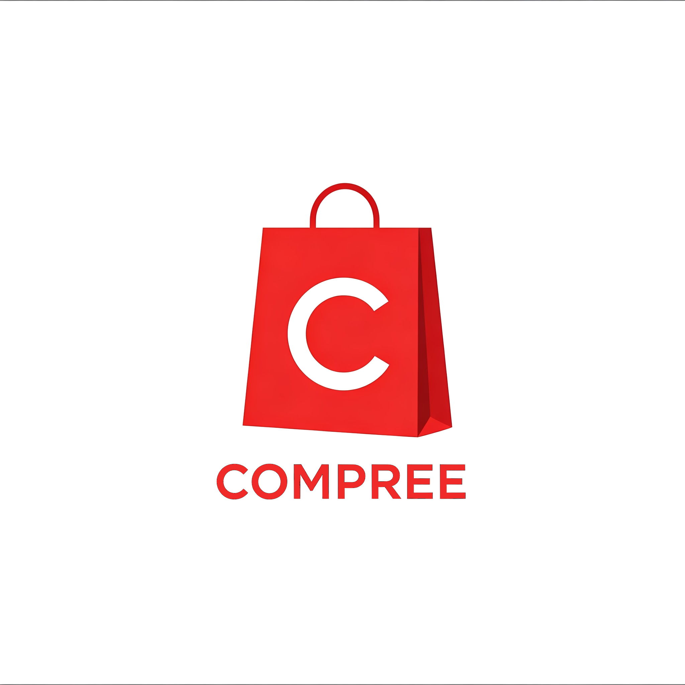

<p align="center">
  <a href="" target="blank"></a>
</p>

  <p align="center">
    Projeto usado durante o curso de NestJS da <a href="https://cursos.alura.com.br" target="_blank">Alura</a>.
  <p align="center">

  <a href="https://www.npmjs.com/" target="_blank">
  <a href='https://nodejs.org/' target='_blank'>
  <a href='https://nestjs.com/' target='_blank'>
  <a href='https://typeorm.io/' target='_blank'></a>
  <a href='https://www.postgresql.org/' target='_blank'></a>
  <a href='https://www.docker.com/' target='_blank'></a>
</p>

## Descrição

**Compree** é uma loja fictícia usada durante os estudos de NestJS. Esse projeto constrói uma API RestFul usando o framework NestJS na construção da aplicação, Docker na construção das dependências de infraestrutura, PosgreSQL para a persistência de dados em conjunto com TypeORM como mapeador de objetos para integração com o banco.

## Instalação

```bash
npm install
```

## Executando

Subindo o as dependencia com `docker-compose`

```bash
docker compose up -d
```

Executando a aplicação

```bash
# development
npm run start

# watch mode
npm run start:dev
```
